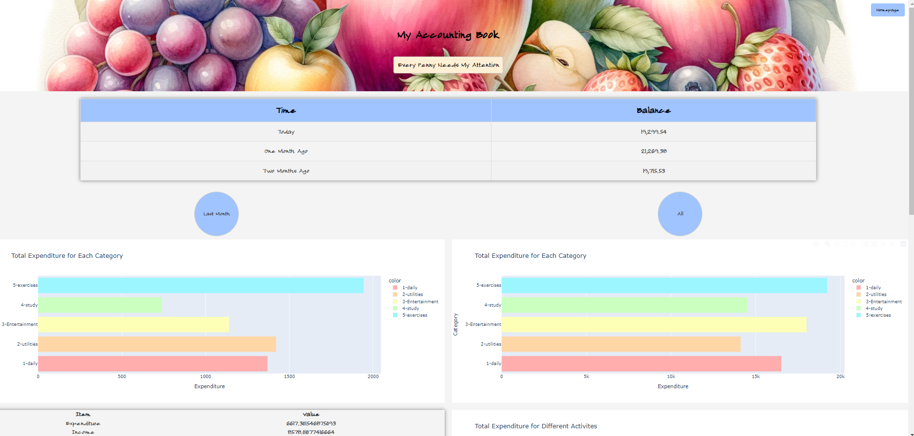

[Chinese](README_cn.md)

# My Personal Management System

## Project Introduction
My Personal Management System is a tool designed to track time and finances. It allows users to input their daily activities and financial transactions easily through Excel, and view statistical data through a user-friendly interface.

## Features
- **Time Tracking**: All time data are stored in an Excel file. Using Excel shortcuts (Ctrl+; for the current date, Ctrl+Shift+; for the current time) makes it easy to record time spent on various activities.
- **Financial Management**: All expenses and income are recorded in another Excel file.
- **Data Statistics and Visualization**: After running the program, users can view statistical data about time and finances on a web page. Statistical charts can be saved and conveniently pasted into a personal journal.
- **Developed with the Assistance of ChatGPT**: This project was primarily developed with the help of ChatGPT.

## Installation and Running Guide
1. Ensure Python 3.11 is installed on your computer.
2. Clone or download this project locally.
3. In the project directory, run `pip install -r requirements.txt` to install necessary dependencies.
4. Execute `app.py` to start the program.
5. Visit `http://127.0.0.1:5000` in your browser to view the application.

## Usage Instructions
- **Recording Time and Money**: Enter data in the respective Excel files.
- **Viewing Statistics**: Start the application and visit the web page interface.

### Time Statistics
- **Weekly Time Analysis**: Users can view the time spent last week on categories such as study, work, and hobbies, as well as the time spent on specific projects.
- **Long-term Project Tracking**: View the total time spent on all projects, study, work, and hobbies since the start of each project.
- **Project Time Details**: Detailed analysis of time spent on each project helps users better understand their time allocation.

### Account Management
- **Account Balance Viewing**: Users can view the total balance of all their accounts.
- **Monthly Financial Summary**: Provides an overview of total income and expenses for the previous month.
- **Expense Category Analysis**: Analyzes and displays the main categories of expenses over time, helping users understand where their money goes.
- **Specific Activity Cost**: Users can calculate all related expenses for specific activities, such as a trip, which is convenient for budget management of special events.

## File Structure and Customization

The main file structure of the project is as follows:

- `src/statistics.py`: Responsible for extracting and processing statistical data. Contains all logic for handling time and financial data.
- `src/visualization.py`: Used for data visualization. Generates all charts and visual presentations in this file.
- `app.py` and related HTML files: Responsible for front-end display and user interaction. Users can customize their interface and output images by modifying these files.

### Customizing Output
To customize output images, users need to update `src/statistics.py`, `src/visualization.py`, `app.py`, and the corresponding HTML files. This includes modifying data processing logic, chart display parameters, as well as layout and styles.

1. **Modify `statistics.py`**: Adjust data extraction and processing logic to meet personal specific needs.
2. **Edit `visualization.py`**: Change the way data is visualized, including chart types, styles, and layouts.
3. **Update `app.py` and HTML files**: Adjust the front-end interface according to personal preferences, including layout, style, and HTML elements of the charts.

By following these steps, users can tailor this personal management system to their needs and preferences, resulting in a more personalized data presentation and user experience.

## Contribution Guide
This is just something I wrote for fun, mainly for my own use. If it can inspire someone, that would make me very happy.
## Acknowledgement
Beautiful Fonts: https://github.com/Warren2060/ChillCalligraphy
## License
This project is open source and follows the [MIT License](https://opensource.org/licenses/MIT). Anyone is free to use, modify, and distribute this software.
